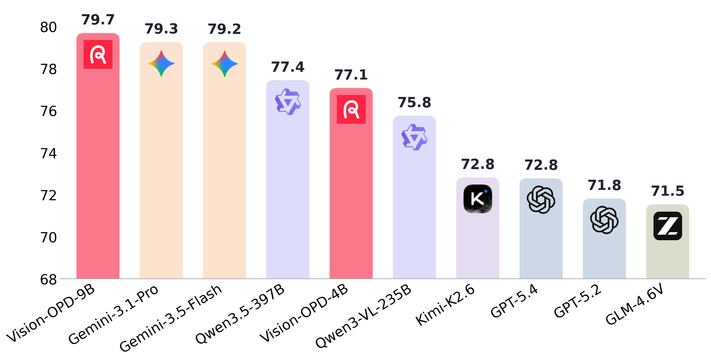

# Vision-OPD

**Vision-OPD: Learning to See Fine-Grained Details for Multimodal LLMs via On-Policy Self-Distillation**

<p align="center">
📃 <a href="https://arxiv.org/pdf/2605.18740" target="_blank">Paper</a> | 
🤗 <a href="https://huggingface.co/datasets/yuanqianhao/Vision-OPD-6K">Training Dataset</a> 
</p>

## News

- **[2026.5.18]** The paper is released on arXiv.
- **[2026.5.19]** The training code and data is released.
- **[2026.5.26]** The evaluation code is released.
- Model release is under company review. Coming soon.

## Overview

Vision-OPD is a regional-to-global on-policy self-distillation framework that transfers a model's own privileged regional perception to its full-image policy, enabling fine-grained visual understanding in a single forward pass — without external teachers, ground-truth labels, reward verifiers, or inference-time tool use.

<p align="center">
  
</p>

<p align="center"><i>Average scores across fine-grained visual understanding benchmarks, including V* Bench, ZoomBench,  HR-Bench 4K, HR-Bench 8K, MME-RealWorld-EN and MME-RealWorld-CN.</i></p>

## Quick Start

### 1. Environment Setup

```bash
conda create -n vision-opd python=3.12 -y
conda activate vision-opd
pip install --upgrade pip
pip install --no-deps -r requirements.txt
pip install -e . --no-deps
pip install flash-attn --no-build-isolation
pip install causal-conv1d==1.6.1 --no-build-isolation
```

#### Ascend 910B / Atlas A2

The Ascend path is separate from the CUDA requirements above. Portable model
and wheel assets can be prepared in x86_64/Python 3.9 WebStudio: pip is
cross-targeted to CPython 3.10/aarch64. Dependency installation still runs only
on the real NPU worker. Configure CANN/NNAL paths, lifecycle switches and hyperparameters in
[`vision_opd_ascend.env`](vision_opd_ascend.env). Asset preparation and training
are deliberately separate:

```bash
# Run once in WebStudio or another preparation host. This default is offline:
# it cross-resolves cp310/aarch64 assets from the supplied wheel/model sources.
VOPD_INTERNAL_WHEEL_DIRS=/path/to/internal/whls \
VOPD_MODEL_SOURCE_DIR=/path/to/Qwen3.5-4B \
bash scripts/prepare_ascend_assets.sh

# Run for every training job after assets are ready.
bash scripts/start_vision_opd_ascend.sh
```

If the WebStudio/preparation host is explicitly allowed to reach Hugging Face, Huawei
OBS and the configured Python index, replace the first command with
`bash scripts/prepare_ascend_assets.sh --online`. This never gives the NPU
worker network access: the training entry remains offline and never invokes
the preparation script.

The entry exports the configuration as real environment variables and performs
the complete training lifecycle: choose Python 3.10 on the aarch64 NPU worker,
create or reuse `envs/runtime/.venv-ascend`, install the official CANN
8.5.1/vLLM-Ascend 0.18 Python
stack, load CANN/NNAL, prepare data, preflight, train, save checkpoints, and
optionally merge the latest checkpoint. ModelArts-injected `VOPD_*` values take
precedence over file defaults.

Installation is split into the official binary lock, a generic runtime lock and
the vLLM hardware-plugin lock. The fixed unit is CANN 8.5.1, torch 2.9.0,
`torch-npu==2.9.0.post1+git4c901a4`,
`triton-ascend==3.2.0.dev20260322`, and vLLM/vLLM-Ascend 0.18.0.

Production installation is fully offline by default and uses
`--no-index --find-links`. Put the complete Python 3.10/aarch64 wheelhouse in
the project-relative `envs/wheels/cp310-aarch64` directory, or set
`VOPD_LOCAL_WHEEL_DIR` to its mounted location. Asset preparation writes a
SHA-256 inventory only after pip resolves the complete dependency closure. The
launcher verifies that manifest and repeats resolution with `pip --dry-run`
before installing the NPU/runtime stack.

The production entry also defaults to Hugging Face offline mode. Mount the
model weights under `envs/models/Qwen3.5-4B`, or set `VOPD_MODEL_PATH` to
another local directory. Preparation records the immutable model revision in
the model directory; the training entry rejects a missing or mismatched asset
manifest.
With `VOPD_REQUIRE_LOCAL_MODEL=1` and `VOPD_HF_OFFLINE=1` (the defaults), a
missing model or dataset fails immediately instead of attempting an external
download.

Every Vision-OPD command derives `PROJECT_ROOT` from its launcher location, so
the complete repository can be mounted at any path. The vendor environment
scripts run without Bash nounset and `ZSH_VERSION` is defined before ATB is
loaded.

### 2. Prepare Training Data

Download and preprocess the [Vision-OPD-6K](https://huggingface.co/datasets/yuanqianhao/Vision-OPD-6K) dataset:

```bash
python scripts/prepare_data.py --data-dir ./data
```

If `data/train.jsonl`, `data/images/images.tar.gz*`, and
`data/teacher_images/teacher_images.tar.gz` are already mounted, no dataset
download is needed:

```bash
python scripts/prepare_data.py --data-dir ./data --skip-download
```

The unified Ascend entry detects this local layout automatically, extracts the
archives, preserves the original compressed files, validates every referenced
student/teacher image, and creates `data/train.parquet` before training.

This downloads images and metadata from HuggingFace, extracts archives, and converts `train.jsonl` to the parquet format expected by the training pipeline.

### 3. Training

Launch Vision-OPD training:

```bash
bash scripts/run_vision_opd.sh
```

For a platform training job, use the production entry instead:

```bash
bash scripts/start_vision_opd_ascend.sh
```

Configure paths and hyperparameters as environment variables, for example:

```bash
VOPD_TRAIN_FILE=/mnt/data/train.parquet \
VOPD_OUTPUT_DIR=/mnt/output/checkpoints \
VOPD_LR=2e-6 \
VOPD_TRAIN_BATCH_SIZE=96 \
VOPD_ROLLOUT_N=8 \
bash scripts/start_vision_opd_ascend.sh
```

ModelArts-provided `MA_NUM_GPUS`, `MA_NUM_HOSTS`, `RANK_ID`,
`ASCEND_DEVICE_ID`, `MA_MOUNT_PATH`, and `MA_LOG_DIR` are detected
automatically. User variables use the `VOPD_` prefix because `MA_` is reserved
by ModelArts.

### 4. Merge Checkpoints

After training, merge the FSDP-sharded checkpoint into a standard HuggingFace model:

```bash
bash scripts/merge_checkpoint.sh <path_to_checkpoint>
```

For example:

```bash
bash scripts/merge_checkpoint.sh ./checkpoints/Vision-OPD-Qwen3.5-4B/global_step_65/
```

This merges the FSDP actor shards, saves the model weights, config, tokenizer, and processor into the specified directory. The merged checkpoint can then be loaded directly with `transformers` or served with vLLM.

### 5. Deployment

Serve the merged checkpoint with vLLM, for example:

```bash
vllm serve <path_to_merged_checkpoint> \
    --gpu-memory-utilization 0.85 \
    --tensor-parallel-size 8 \
    --served-model-name Vision-OPD-4B \
    --trust-remote-code
```

The server listens on port 8000 by default. You can then query the model via the OpenAI-compatible API at `http://localhost:8000/v1/chat/completions`.

For Ascend 910B, start the vLLM-Ascend server with:

```bash
bash scripts/serve_vision_opd_ascend.sh <path_to_merged_checkpoint>
```

See [ASCEND_910B.md](ASCEND_910B.md) for the supported version matrix,
configuration overrides, multi-card examples and troubleshooting boundaries.

### 6. Evaluation

Evaluate the deployed model on fine-grained visual benchmarks:

```bash
API_BASE="http://localhost:8000/v1/" \
OPENAI_MODEL_ID="Vision-OPD-4B" \
JUDGE_API_BASE="YOUR_JUDGE_API_BASE" \
JUDGE_MODEL="YOUR_JUDGE_MODEL_NAME" \
BENCHMARK="vstar,zoombench,hrbench-4k,hrbench-8k,mme-realworld,mme-realworld-cn" \
bash eval/run_eval.sh
```

Supported benchmarks: `vstar`, `zoombench`, `hrbench-4k`, `hrbench-8k`, `mme-realworld`, `mme-realworld-cn`, `mme-realworld-lite`, `visualprobe`, `mmvp`, `cv-bench`, `mmstar`, `pope`.

The evaluation script runs inference via the OpenAI-compatible API. Judge configuration can be set via `JUDGE_API_BASE` / `JUDGE_MODEL_PATH` environment variables. We use `openai/gpt-oss-120b` as the judge model. Other powerful models like Qwen3.5 or closed-source models are also recommended.

To evaluate Qwen3.5 models as baselines, set `ENABLE_THINKING=False` to run in non-thinking mode, for example:

```bash
API_BASE="http://localhost:8000/v1/" \
OPENAI_MODEL_ID="Qwen3.5-4B" \
ENABLE_THINKING=False \
JUDGE_API_BASE="YOUR_JUDGE_API_BASE" \
JUDGE_MODEL="YOUR_JUDGE_MODEL_NAME" \
BENCHMARK="vstar,zoombench,hrbench-4k,hrbench-8k,mme-realworld,mme-realworld-cn" \
bash eval/run_eval.sh
```

## Citation

If you find Vision-OPD useful for your research, please consider citing:

```bibtex
@article{yuan2026vision,
  title={Vision-OPD: Learning to See Fine Details for Multimodal LLMs via On-Policy Self-Distillation},
  author={Yuan, Qianhao and Lou, Jie and Yu, Xing and Lin, Hongyu and Sun, Le and Han, Xianpei and Lu, Yaojie},
  journal={arXiv preprint arXiv:2605.18740},
  year={2026}
}
```

## License

Apache-2.0 License
